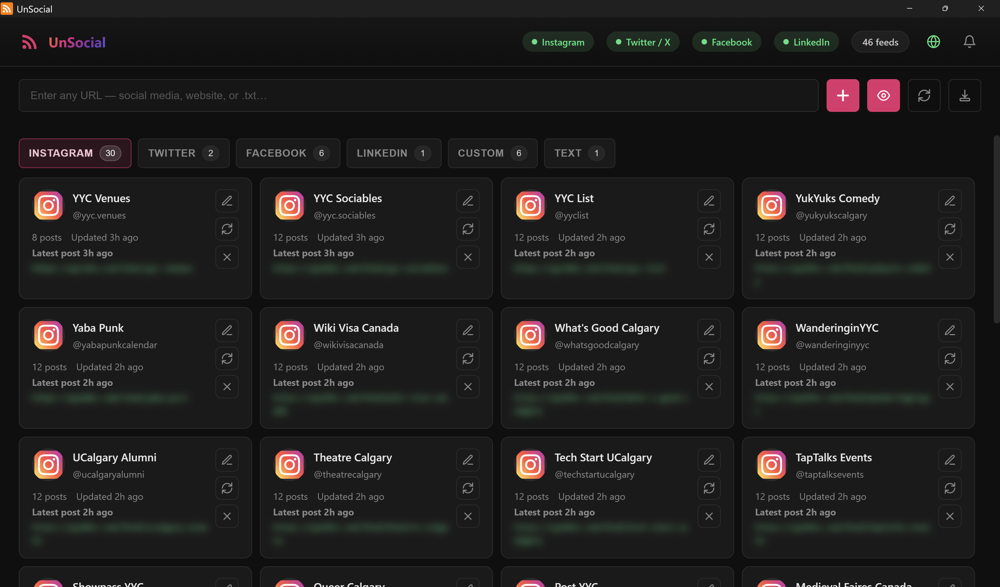

# UnSocial

**Social media → RSS feed converter** — a Windows desktop app that turns Instagram, Twitter/X, Facebook, and LinkedIn profiles into standard RSS/Atom feeds you can subscribe to in any feed reader.




## Features

- **Multi-platform** — Supports Instagram, Twitter/X, Facebook (pages, groups, events), and LinkedIn (profiles, companies)
- **Local RSS server** — Serves feeds on `http://localhost:3845/feed/<username>` — works with any RSS reader
- **Public access via Cloudflare Tunnel** — Optionally expose feeds to the internet through your own domain
- **Auto-refresh** — Smart staggered refresh keeps feeds up-to-date without hammering platforms
- **OPML export** — One-click export for importing into other RSS readers
- **Notification system** — Alerts for stale feeds, failed refreshes, and connectivity issues
- **System tray** — Minimizes to tray and runs in the background
- **Portable** — Single-exe portable build; data is stored next to the executable

## Getting Started

### Prerequisites

- **Node.js** 18+ and **npm**
- **Windows** (the app is built for Windows; other platforms may work but are untested)

### Install & Run

```bash
# Clone the repo
git clone https://github.com/<your-username>/UnSocial.git
cd UnSocial

# Install dependencies
npm install

# Run in development mode
npm start
```

### Build a Portable Executable

```bash
npm run build
```

The output will be in the `dist/` folder as a single portable `.exe`.

## Usage

1. **Log in** — Click a platform badge in the header bar to open a login window. The app uses your browser session to access posts.
2. **Add a feed** — Paste a profile URL (e.g. `https://www.instagram.com/natgeo/`) into the input bar and click **+ Add Feed**.
3. **Subscribe** — Copy the local RSS URL from the feed card and add it to your RSS reader.

### Public Access (Cloudflare Tunnel)

To make your feeds accessible from the internet (e.g. for phone-based RSS readers), you need to set up a Cloudflare Tunnel.

#### Installing `cloudflared`

`cloudflared` is Cloudflare's official tunnel client. Install it for your platform:

**Windows (winget — recommended):**
```bash
winget install Cloudflare.cloudflared
```

**Windows (Chocolatey):**
```bash
choco install cloudflared
```

**Windows (manual):** Download the latest `.msi` or `.exe` from the [Cloudflare downloads page](https://developers.cloudflare.com/cloudflare-one/connections/connect-networks/downloads/) and add it to your PATH.

**macOS (Homebrew):**
```bash
brew install cloudflared
```

**Linux (apt):**
```bash
curl -fsSL https://pkg.cloudflare.com/cloudflare-main.gpg | sudo tee /usr/share/keyrings/cloudflare-main.gpg >/dev/null
echo 'deb [signed-by=/usr/share/keyrings/cloudflare-main.gpg] https://pkg.cloudflare.com/cloudflared any main' | sudo tee /etc/apt/sources.list.d/cloudflared.list
sudo apt update && sudo apt install cloudflared
```

Verify the installation:
```bash
cloudflared --version
```

> **Note:** You also need a Cloudflare account and a domain managed by Cloudflare DNS. Free-tier accounts work fine.

#### Setting Up the Tunnel in UnSocial

1. Click **⚙️ Setup** in the Public Access panel.
2. Enter your **domain** (e.g. `feeds.example.com`) and a **tunnel name**, then click **Save**.
3. Follow the guided steps to authenticate, create the tunnel, and route DNS.
4. Click **▶ Start Tunnel** — your feeds will be available at `https://your-domain/feed/<username>`.

## Project Structure

```
UnSocial/
├── assets/              # App icons
├── src/
│   ├── main.js          # Electron main process
│   ├── preload.js       # Context bridge (IPC API)
│   ├── feed-server.js   # Local Express RSS server
│   ├── rss-generator.js # RSS/Atom XML generation
│   ├── tunnel.js        # Cloudflare Tunnel management
│   ├── scraper.js       # Instagram scraper
│   ├── scraper-twitter.js
│   ├── scraper-facebook.js
│   ├── scraper-linkedin.js
│   └── renderer/
│       ├── index.html   # App UI
│       ├── app.js       # Renderer logic
│       └── styles.css   # Styles
└── package.json
```

## Configuration

All settings are persisted via `electron-store` in the app's user data directory (or beside the portable exe):

| Setting | Default | Description |
|---------|---------|-------------|
| `serverPort` | `3845` | Local RSS server port |
| `tunnelDomain` | *(empty)* | Your custom domain for public feed access |
| `tunnelName` | `unsocial-tunnel` | Cloudflare Tunnel name |
| `checkIntervalMinutes` | `30` | Base refresh interval (actual timing is randomized) |

## Contributing

Contributions are welcome! Please open an issue first to discuss what you'd like to change.

1. Fork the repository
2. Create a feature branch (`git checkout -b feature/my-feature`)
3. Commit your changes (`git commit -m 'Add my feature'`)
4. Push to the branch (`git push origin feature/my-feature`)
5. Open a Pull Request

## License

This project is licensed under the MIT License — see the [LICENSE](LICENSE) file for details.

## Disclaimer

This tool is intended for personal use. Scraping social media platforms may violate their terms of service. Use responsibly and at your own risk. The authors are not responsible for any misuse or consequences arising from the use of this software.
