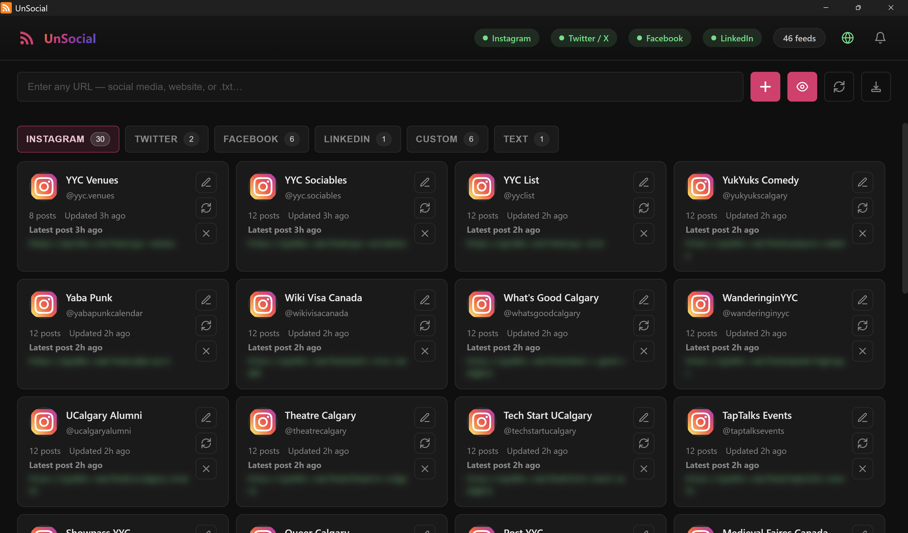

# UnSocial

**Social media → RSS feed converter** — a desktop app for Windows, macOS (Apple Silicon), and Linux that turns Instagram, Twitter/X, Facebook, and LinkedIn profiles into standard RSS/Atom feeds you can subscribe to in any feed reader.




## Features

- **Multi-platform** — Supports Instagram, Twitter/X, Facebook (pages, groups, events), and LinkedIn (profiles, companies)
- **Local RSS server** — Serves feeds on `http://localhost:3845/feed/<username>` — works with any RSS reader
- **Public access via Cloudflare Tunnel or Tailscale Funnel** — Optionally expose feeds to the internet through your own domain (Cloudflare) or an auto-assigned `*.ts.net` hostname (Tailscale)
- **Auto-refresh** — Smart staggered refresh keeps feeds up-to-date without hammering platforms
- **OPML export** — One-click export for importing into other RSS readers
- **Notification system** — Alerts for stale feeds, failed refreshes, and connectivity issues
- **System tray** — Minimizes to tray and runs in the background
- **Feed authentication** — Optional token-based auth to protect feeds when exposed publicly
- **Portable** — Single-exe portable build (Windows), .dmg (macOS), or .AppImage (Linux); data is stored next to the app
- **Cross-platform data** — Share the same `UnSocial-userdata` folder between Windows, macOS, and Linux

## Getting Started

### Prerequisites

- **Node.js** 18+ and **npm**
- **Windows**, **macOS** (Apple Silicon), or **Linux**

### Install & Run

```bash
# Clone the repo
git clone https://github.com/<your-username>/UnSocial.git
cd UnSocial

# Install dependencies
npm install

# Run in development mode
npm start
```

### Building the App

All builds output to the `dist/` folder. Each platform must be built **on that platform** (no cross-compiling).

#### Windows — Portable `.exe`

```bash
npm run build
```

Produces a single portable `UnSocial.exe`. No installer needed — just run it.

#### macOS (Apple Silicon) — `.dmg`

```bash
npm run build:mac
```

Produces a `.dmg` for Apple Silicon (arm64). Mount, drag to wherever you want, done.

> **Note:** The DMG is unsigned. On first launch, right-click the app → **Open** to bypass Gatekeeper.

#### Linux — `.AppImage`

```bash
npm run build:linux
```

Produces an `.AppImage`. Make it executable (`chmod +x UnSocial-*.AppImage`) and run it.

#### Build Script Reference

Each platform has four variants — the default bumps the patch version, the others bump minor/major, or build without any version change:

| | Patch (default) | Minor | Major | No version bump |
|---|---|---|---|---|
| **Windows** | `npm run build` | `npm run build:minor` | `npm run build:major` | `npm run build:current` |
| **macOS** | `npm run build:mac` | `npm run build:mac:minor` | `npm run build:mac:major` | `npm run build:mac:current` |
| **Linux** | `npm run build:linux` | `npm run build:linux:minor` | `npm run build:linux:major` | `npm run build:linux:current` |

### Portable Data (Cross-Platform)

UnSocial stores all feeds, settings, and session data in a `UnSocial-userdata` folder next to the executable (Windows), `.app` bundle (macOS, when not in `/Applications`), or AppImage (Linux).

To migrate your data between platforms, simply copy the `UnSocial-userdata` folder next to the app on the other platform. Your feed list, RSS data, and settings will carry over. You will need to re-login to each social media platform, as login sessions are device/IP-bound by the platforms themselves.

## Usage

1. **Log in** — Click a platform badge in the header bar to open a login window. The app uses your browser session to access posts.
2. **Add a feed** — Paste a profile URL (e.g. `https://www.instagram.com/natgeo/`) into the input bar and click **+ Add Feed**.
3. **Subscribe** — Copy the local RSS URL from the feed card and add it to your RSS reader.

### Public Access

To make your feeds accessible from the internet (e.g. for phone-based RSS readers), pick a tunnel provider in the **Public Access** panel. UnSocial supports two:

| Provider | URL you get | Needs a custom domain? | Best for |
|----------|-------------|-----------------------|----------|
| **Cloudflare Tunnel** | `https://feeds.example.com` | Yes (on Cloudflare DNS) | Anyone who already owns a domain |
| **Tailscale Funnel** | `https://<machine>.<tailnet>.ts.net` | No | Zero-config public URLs |

Switch between them anytime with the **Cloudflare / Tailscale** toggle at the top of the Public Access panel — UnSocial stops the other provider when you switch.

### Public Access — Cloudflare Tunnel

#### Installing `cloudflared`

`cloudflared` is Cloudflare's official tunnel client. Install it for your platform:

**Windows (winget — recommended):**
```bash
winget install Cloudflare.cloudflared
```

**Windows (Chocolatey):**
```bash
choco install cloudflared
```

**Windows (manual):** Download the latest `.msi` or `.exe` from the [Cloudflare downloads page](https://developers.cloudflare.com/cloudflare-one/connections/connect-networks/downloads/) and add it to your PATH.

**macOS (Homebrew):**
```bash
brew install cloudflared
```

**Linux (apt):**
```bash
curl -fsSL https://pkg.cloudflare.com/cloudflare-main.gpg | sudo tee /usr/share/keyrings/cloudflare-main.gpg >/dev/null
echo 'deb [signed-by=/usr/share/keyrings/cloudflare-main.gpg] https://pkg.cloudflare.com/cloudflared any main' | sudo tee /etc/apt/sources.list.d/cloudflared.list
sudo apt update && sudo apt install cloudflared
```

Verify the installation:
```bash
cloudflared --version
```

> **Note:** You also need a Cloudflare account and a domain managed by Cloudflare DNS. Free-tier accounts work fine.

#### Setting Up the Tunnel in UnSocial

1. Click **⚙️ Setup** in the Public Access panel.
2. Enter your **domain** (e.g. `feeds.example.com`) and a **tunnel name**, then click **Save**.
3. Follow the guided steps to authenticate, create the tunnel, and route DNS.
4. Click **▶ Start Tunnel** — your feeds will be available at `https://your-domain/feed/<username>`.

### Public Access — Tailscale Funnel

Tailscale Funnel exposes a local port at a `https://<machine>.<tailnet>.ts.net` URL without owning a domain. Setup takes a minute.

#### Installing Tailscale

**Windows (winget — recommended):**
```bash
winget install Tailscale.Tailscale
```

**macOS (Homebrew):**
```bash
brew install --cask tailscale
```

**Linux, manual downloads, and other platforms:** see [tailscale.com/download](https://tailscale.com/download).

After install, sign in by running `tailscale up` or opening the GUI tray icon.

#### Enable Funnel + HTTPS on your tailnet

Funnel is opt-in per-tailnet and requires HTTPS to be enabled. This is a one-time step in the [admin console](https://login.tailscale.com/admin):

1. **Enable HTTPS certificates** — go to **DNS** and click *Enable HTTPS*.
2. **Grant the `funnel` attribute to this device** — in **Access Controls**, add a `nodeAttrs` grant, for example:

```jsonc
{
  "nodeAttrs": [
    { "target": ["autogroup:member"], "attr": ["funnel"] }
  ]
}
```

#### Start the tunnel in UnSocial

1. Switch the Public Access toggle to **Tailscale**.
2. Click **⚙️ Setup** and verify that each step shows a ✓ (install, login, funnel enabled).
3. Click **▶ Start Tunnel** — UnSocial runs `tailscale funnel --bg <port>` and publishes your feed server. Your URLs now look like `https://<machine>.<tailnet>.ts.net/feed/<username>`.

Behind the scenes, Tailscale Funnel is a daemon-managed persistent forward, so UnSocial doesn't need to keep a child process alive. Stopping the tunnel runs `tailscale funnel reset`.

#### Feed Authentication

If you're exposing feeds publicly, you can protect them with a token so only you (and your RSS reader) can access them.

1. In the **Public Access** panel, find the **Feed Authentication** section.
2. Click **Generate Token** — a secure random token is created and saved.
3. All feed URLs automatically update to include `?token=<your-token>` — copy these into your RSS reader.
4. Unauthenticated requests (including the root `/` discovery endpoint) receive a `401 Unauthorized` response.

Your RSS reader can authenticate in two ways:
- **Query parameter:** `https://your-domain/feed/username?token=<your-token>`
- **Bearer header:** `Authorization: Bearer <your-token>`

To disable authentication, click **Remove Token**. Feeds revert to fully public.

## Project Structure

```
UnSocial/
├── assets/              # App icons
├── src/
│   ├── main.js          # Electron main process
│   ├── preload.js       # Context bridge (IPC API)
│   ├── feed-server.js   # Local Express RSS server
│   ├── rss-generator.js # RSS/Atom XML generation
│   ├── tunnel.js        # Tunnel dispatcher (Cloudflare / Tailscale)
│   ├── tunnel-cloudflare.js
│   ├── tunnel-tailscale.js
│   ├── scraper.js       # Instagram scraper
│   ├── scraper-twitter.js
│   ├── scraper-facebook.js
│   ├── scraper-linkedin.js
│   └── renderer/
│       ├── index.html   # App UI
│       ├── app.js       # Renderer logic
│       └── styles.css   # Styles
└── package.json
```

## Configuration

All settings are persisted via `electron-store` in the app's user data directory (or beside the portable exe):

| Setting | Default | Description |
|---------|---------|-------------|
| `serverPort` | `3845` | Local RSS server port |
| `tunnelProvider` | `cloudflare` | Active tunnel provider: `cloudflare` or `tailscale` |
| `tunnelDomain` | *(empty)* | Your custom domain for public feed access (Cloudflare only) |
| `tunnelName` | `unsocial-tunnel` | Cloudflare Tunnel name |
| `checkIntervalMinutes` | `30` | Base refresh interval (actual timing is randomized) |
| `feedToken` | *(empty)* | When set, all feed server requests require this token |

## Contributing

Contributions are welcome! Please open an issue first to discuss what you'd like to change.

1. Fork the repository
2. Create a feature branch (`git checkout -b feature/my-feature`)
3. Commit your changes (`git commit -m 'Add my feature'`)
4. Push to the branch (`git push origin feature/my-feature`)
5. Open a Pull Request

Windows (Patch/Minor/Major): `npm run build` / `npm run build:minor` / `npm run build:major`
macOS (Patch/Minor/Major): `npm run build:mac` / `npm run build:mac:minor` / `npm run build:mac:major`
Linux (Patch/Minor/Major): `npm run build:linux` / `npm run build:linux:minor` / `npm run build:linux:major`

## License

This project is licensed under the MIT License — see the [LICENSE](LICENSE) file for details.

## Disclaimer

This tool is intended for personal use. Scraping social media platforms may violate their terms of service. Use responsibly and at your own risk. The authors are not responsible for any misuse or consequences arising from the use of this software.
